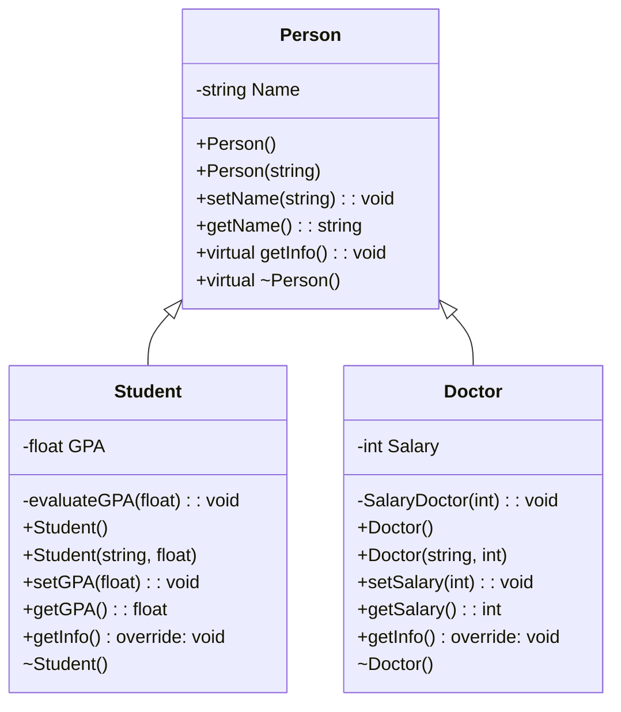

# Person Inheritance Hierarchy  
A C++ program demonstrating **Encapsulation**, **inheritance** and **polymorphism** using constructors and destructors , Dynamic memory allocation with `new` and `delete` with three classes:  
- Base class: `Person`  
- Derived classes: `Student` and `Doctor`  

## Features  
- **Inheritance**: `Student` and `Doctor` inherit from `Person`.  
- **Polymorphism**: Virtual functions (`getInfo()`, destructor) enable runtime binding.  
- **Encapsulation**: Private members with public getters/setters.  
- **Dynamic Memory**: Objects created with `new`/`delete` in `main()`.  

## UML Diagram  


### Key Relationships  
- **Inheritance (◁)**:  
  - `Student` and `Doctor` derive from `Person`.  
- **Polymorphism**:  
  - `getInfo()` and destructors are `virtual` for dynamic dispatch.  

## Code Structure  
### 1. Base Class: `Person`  
- **Members**:  
  - `Name` (private string).  
- **Methods**:  
  - Constructors (default/parameterized).  
  - Virtual `getInfo()` and destructor.  

### 2. Derived Class: `Student`  
- **Members**:  
  - `GPA` (private float).  
- **Methods**:  
  - `evaluateGPA()`: Validates GPA and prints a grade category.  
  - Overrides `getInfo()` to include GPA.  

### 3. Derived Class: `Doctor`  
- **Members**:  
  - `Salary` (private int).  
- **Methods**:  
  - `SalaryDoctor()`: Ensures salary is non-negative.  
  - Overrides `getInfo()` to include salary.  

## How to Run  
1. Compile with any C++ compiler (e.g., g++):  
   ```bash
   g++ main.cpp -o program
   ```
2. Execute:  
   ```bash
   ./program
   ```

## Expected Output  
```plaintext
The person name is Ali, The GPA is 3.5
The person name is Dr. Samir, The salary is 12000
Student is destroyed
Person is destroyed
Doctor is destroyed
Person is destroyed
```

## Future Improvements
* Add more roles (e.g., `Teacher`, `Engineer`) that inherit from `Person`.
* Handle GPA and salary validation with exceptions.
* Save and load person data from files.

## Dependencies  
- C++11 or later.  
- `<iostream>` and `<string>` libraries.  

## Notes  
- The UML diagram can be rendered using tools like [Mermaid Live Editor](https://mermaid.live/).  
- Destructor messages confirm proper object cleanup.  

---

### How to Use the UML Diagram  
1. **Visualization**: Paste the Mermaid code into a Markdown viewer (e.g., GitHub, VS Code with Mermaid plugin).  
2. **Key Symbols**:  
   - `-` private, `+` public.  
   - `◁` inheritance.  
